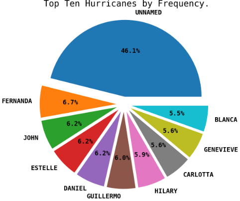
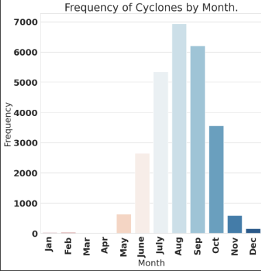
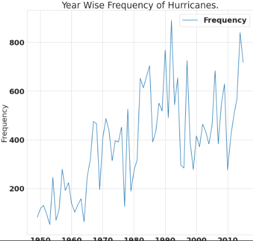
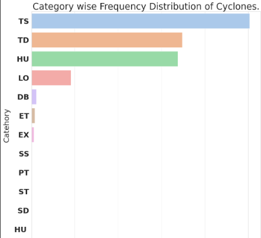
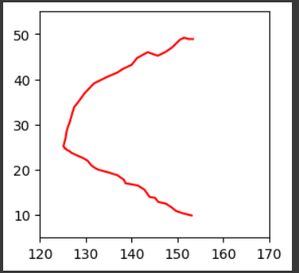
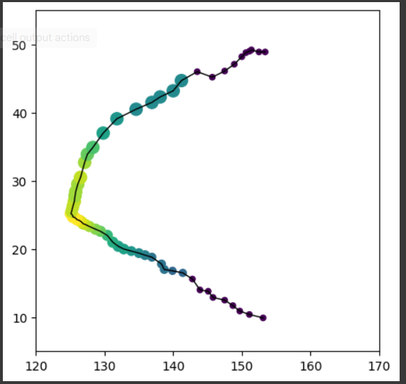
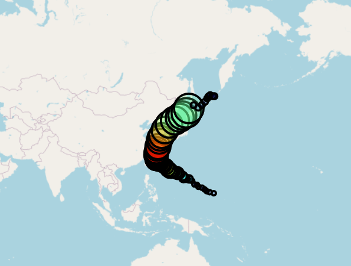

# Application of AI/ML Algorithms on Tropical Cyclone Forecasting

Analysing the Data set from various meterological department for classification of cyclone and generationg the time series of those cyclone.

## Screenshots

